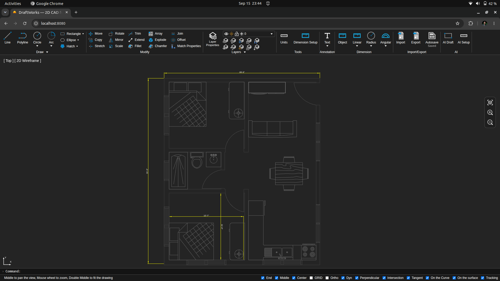
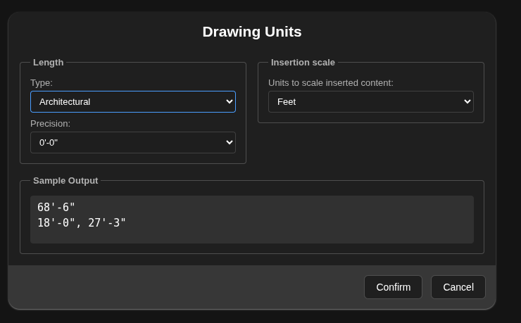
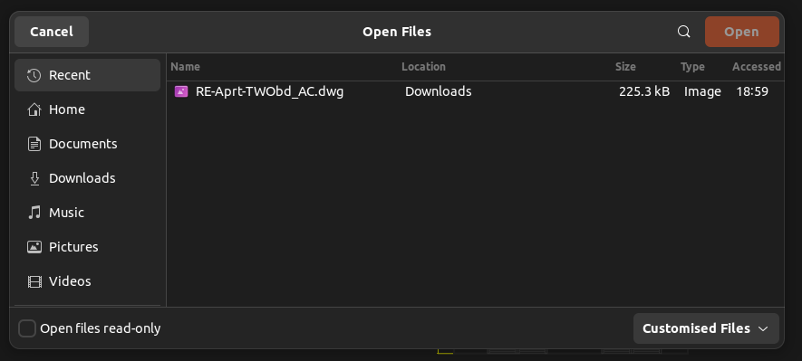
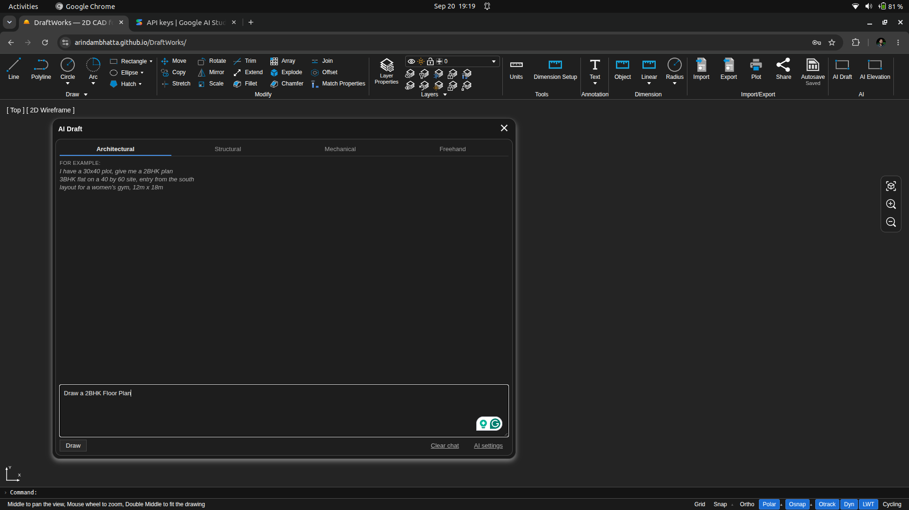
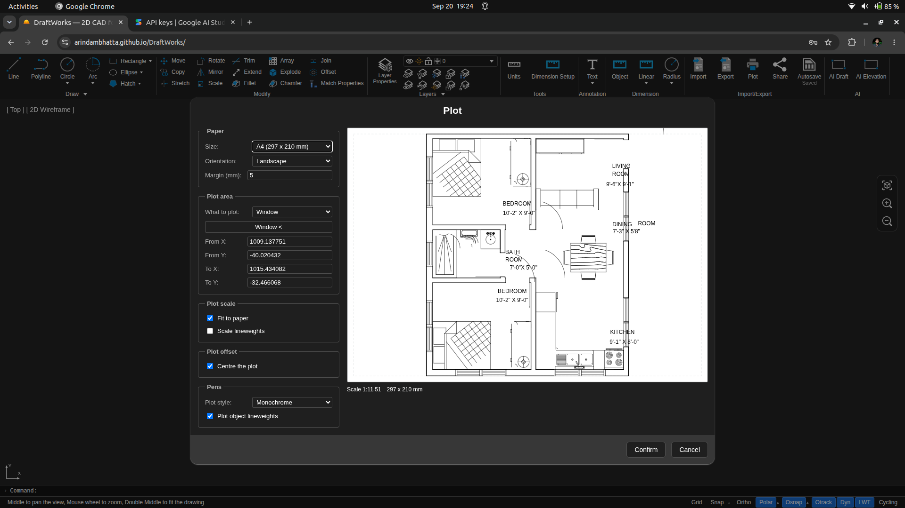

<div align="center">

# DraftWorks

**2D CAD drafting that opens in a browser tab.**

Structural drawings, architectural plans and elevations — with your real DWG files, at real scale, with no install and no license.

[**→ Open the app**](https://arindambhatta.github.io/DraftWorks/) · [Report an issue](https://github.com/ArindamBhatta/DraftWorks/issues) · [Architecture notes](doc/architecture.md)



</div>

---

## Why this exists

Every drafting tool asks you to choose between two bad options.

The desktop ones are correct but heavy: a license, an install, a machine you have to be sitting at. The browser ones are convenient but approximate — they draw pixels, call it CAD, and fall apart the moment someone sends you a DWG.

DraftWorks is the third option. Real B-Rep geometry from the OCCT kernel compiled to WebAssembly, AutoCAD's command line and function keys, your actual DWG files opening and saving locally — in a tab, on any machine, in about two seconds.

**Nothing you draw leaves your computer.** There is no backend. Your drawings live in your browser, your DWG conversion happens in your browser, and if you use the AI features, your API key is yours and the request goes straight from the page.

---

## What you get

### 1. It asks the right questions before you draw a line

<!-- SCREENSHOT: doc/images/unit-setup.png — the Unit Setup dialog, showing the length-type dropdown open and the live Sample Output -->


Start a new drawing, and DraftWorks asks what every experienced draftsman sets up first, instead of dropping you on a blank canvas with defaults you'll discover are wrong three hours in.

**Units** — Architectural, Decimal, Engineering, Fractional or Scientific, with the precision list changing to match. Pick Architectural and you get fraction denominators down to 1/128". Pick Decimal and you get 0–8 places. Insertion units from millimeters to feet. A live sample reformats as you change it, so you see `5'-8 1/2"` before you commit.

It reads input the way a draftsman writes it: `5'-8 1/2"`, `11'2"`, `8 1/2"`, `1745.50`, `1.7455E+03` all parse. Rounding happens at fraction granularity, so `11.99"` becomes `1'-0"` and not `0'-11"`.

**Dimension styles** — a real named style table with current-style selection and unsaved overrides, exactly like AutoCAD's. Settings map one-to-one onto the DIMVARs you already know: `DIMDLE`, `DIMEXE`, `DIMEXO`, `DIMSE1`/`DIMSE2`, `DIMATFIT`, `DIMTOFL`, `DIMTOL`, `DIMGAP`. Arrowheads set independently per end. Tolerances with method, precision, alignment and zero suppression. ISO defaults out of the box — 2.5 text height, 2.5 arrows, 1.25 extension.

Asked once. Remembered after that — reopen the app and you go straight to a blank drawing.

### 2. Your DWG files just open

<!-- SCREENSHOT: doc/images/dwg-import.png — a real DWG opened in DraftWorks, layers visible in the panel -->


DWG in, DWG out. DXF in, DXF out. Layers, linetypes and lineweights survive the round trip.

This is the part most browser CAD tools skip, because DWG is a closed, undocumented format. The usual advice is "convert it in AutoCAD first" — which is not a workaround, because anyone who has AutoCAD doesn't need this application.

So DraftWorks ships LibreDWG compiled to WebAssembly and does the conversion **locally, in your tab**. Your drawing is never uploaded anywhere. The module loads on demand, so you only pay for it when you open a DWG.

Honest about the edges: export targets AutoCAD 2000 (R2000) — that's LibreDWG's encoder ceiling, and the dialog says so rather than leaving it vague. Unsupported entities are reported, never dropped silently. If DWG encoding fails you get told, not a DXF quietly renamed `.dwg`.

### 3. AI that drafts — and asks before it guesses

<!-- SCREENSHOT: doc/images/ai-panel.png — the AI panel mid-conversation, showing a clarifying question and a geometry preview -->


Describe what you need. Get real geometry you can dimension, edit and export.

> *"400 dia 12 m pile with helical stirrups"*
> *"3-pile pile cap, plan and section"*
> *"I have a 30x40 plot, give me a 2BHK plan"*
> *"flange, 150 NB, 8 bolt holes"*

Four modes — **Architectural**, **Structural**, **Mechanical** and **Freehand**. The three technical modes **ask clarifying questions before drawing anything**, because a pile detail with a guessed cover depth is worse than no pile detail. Freehand skips the questions and just sketches.

Everything lands as a **preview you confirm** before it touches your drawing. If a parameter was misread, an **Adjust** form lets you correct it without retyping the sentence — and that form works with no API key and no network at all. Each mode keeps its own conversation, so a follow-up revises that drawing rather than starting over. You can edit an earlier prompt and the thread rewinds to it.

**ELEVATION** is the one to try. Draw a plan, pick two corners, choose a side — and DraftWorks reads the facade out of your actual geometry, so openings land at the plan's own spacing. It then asks only what a plan cannot tell it: storeys, plinth, floor-to-floor, sill, lintel, roof type. No AI involved, no guessing.

Bring your own key: **Claude** (`claude-opus-5`) or **Gemini** (`gemini-2.5-pro`). Stored in your browser, sent straight to the provider. Point it at your own proxy if you'd rather keep the key server-side.

### 4. Your work saves itself
There is no Save button, because there is nothing to remember to press.

Every edit schedules a save two seconds after you stop working — debounced, not a timer that fires mid-command. It writes to IndexedDB **backup first, then primary**, so a browser that dies mid-write leaves your last good drawing intact in both slots instead of a hole. A status light in the ribbon tells you where you stand: pending, saving, saved, offline, error.

Multiple drawings open at once, each saving independently. A recents list with thumbnails. `Ctrl+S` still works if your hands insist.

### 5. Plots at real scale, to PDF

<!-- SCREENSHOT: doc/images/plot-dialog.png — the plot dialog with the live sheet preview -->


A0 through A4, Letter, Tabloid or custom. Portrait or landscape. Display, Extents or Window.

Standard scales — **1:1, 1:2, 1:5, 1:10, 1:20, 1:25, 1:50, 1:100, 1:200, 1:500, 1:1000** — plus fit-to-paper and free numeric. Draw in feet and plot at 1:50 and the conversion is handled; your sheet comes out right.

Plot styles for Color, Monochrome and Grayscale. Lineweights honored, and *not* scaled by default, because a 0.5 mm pen is 0.5 mm on paper whatever the drawing scale. Plot offset, centering, unprintable margin.

And a **live preview before you commit**, rendering the same sheet the PDF writer uses — not an approximation of it. A plot is the one operation you can't undo.

### 6. The muscle memory carries over

**72 commands**, with the aliases already in your fingers.

`l` line · `pl` polyline · `c` circle · `a` arc · `rec` rectangle · `pol` polygon · `spl` spline · `h` hatch · `t` mtext · `dt` text · `po` point
`m` move · `co` copy · `ro` rotate · `mi` mirror · `sc` scale · `s` stretch · `tr` trim · `ex` extend · `o` offset · `f` fillet · `cha` chamfer · `ar` array · `br` break · `j` join · `x` explode · `ma` matchprop · `e` erase · `pr` properties
`dli` linear · `dal` aligned · `dra` radius · `ddi` diameter · `dan` angular · `d` dimstyle
`la` layer, plus all ten LAY* quick actions — LAYOFF, LAYISO, LAYFRZ, LAYLCK, LAYMCUR and the rest

**Space and Enter repeat the last command.** Trim and Extend have Quick and Standard modes. Fillet and Chamfer carry Radius, Distance, Angle and Trim/No-Trim. Array does rectangular and polar. Offset has Through. The command line suggests as you type and keeps history.

### 7. Snapping you can trust
Fifteen object snap modes — endpoint, midpoint, center, intersection, perpendicular, tangent, extension, parallel, on-curve, vertex and more — with AutoCAD-style marker glyphs sized in pixels, so they stay readable at any zoom. The snap you'll actually get is amber; the ones merely on offer are green.

The function keys are where you left them:

| | | | |
|---|---|---|---|
| **F3** Object snap | **F7** Grid | **F8** Ortho | **F9** Grid snap |
| **F10** Polar tracking | **F11** Snap tracking | **F12** Dynamic input | **F1** Shortcuts |

**Ortho constrains direction without giving up your snaps.** Drag vertically onto an endpoint that shares your reference X and you get that endpoint exactly — marker and all — with the segment still perfectly vertical. Polar tracking radiates paths at every multiple of your configured angle. Ortho and Polar interlock, as they should.

Dynamic input boxes at the crosshair for typed distances and angles.

### 8. Layers and properties, transactional

Per-layer color, lock, freeze, linetype and lineweight — and layer changes go on the undo stack like everything else. A Layers widget laid out the way you expect: properties on the left, current-layer combo above the quick actions.

Linetypes resolve `byLayer` before they reach the renderer. A properties panel with typed editors for color, layer, linetype, transform and measured geometry facts. MATCHPROP to copy between objects.

**Every edit is a transaction.** Undo and redo cover all of it.

---

## What it doesn't do yet

Worth saying plainly, so nothing surprises you:

- **No blocks.** No BLOCK/INSERT/WBLOCK, no block table. Folders group objects in the project tree; imported files land in a folder of their own.
- **Model space only.** No layout tabs or paper space — scale is handled at plot time.
- **No templates.** New drawings start blank and are configured by the setup prompts.
- **No image export.** PDF via plot, DWG/DXF via export, and that's the list.
- Circle Tan-Tan-Radius and Tan-Tan-Tan are visible but greyed out — the tangent solve isn't written yet.

### Roadmap

Cloud-hosted drawings, live collaboration and shared links are planned for v2 and are **not in this build** — the Share button currently hands out a link to the app, not to your drawing.

---

## Try it and tell me what's wrong

**[arindambhatta.github.io/DraftWorks](https://arindambhatta.github.io/DraftWorks/)** — no signup, no install.

I'm building this for civil engineers, and the fastest way it gets good is people who draft for a living telling me where it fights them. Open an issue for anything: a command that behaves wrong, a DWG that won't import, a dialog that asks the wrong question, a dimension that plots at the wrong size. Attach the file if you can.

If it's useful to you, a ⭐ genuinely helps more people find it.

---

## Running it locally

```bash
npm install
npm run dev
```

The compiled OCCT and LibreDWG kernels are committed, so no WASM toolchain is needed. Run `npm run setup:wasm` and `npm run build:wasm` only if you change the C++ in `cpp/`.

```bash
npm run build   # production build
npm test        # test suite
npm run check   # lint/format with Biome
```

See [doc/architecture.md](doc/architecture.md) for how the packages fit together.

## Contributing

Pull requests are welcome, from a translation to a new command. [CONTRIBUTING.md](CONTRIBUTING.md) covers setup, how a command is wired up, and a list of problems ready to pick up.

## Built on

DraftWorks stands on [Chili3D](https://github.com/xiangechen/chili3d) by [xiangechen](https://github.com/xiangechen) — an excellent open-source browser CAD project. The OCCT/WebAssembly integration, the core document/command/snapping engine and the Three.js rendering layer started there and were adapted and extended toward 2D civil-engineering drafting. Many thanks to its authors and contributors.

DWG support uses [LibreDWG](https://www.gnu.org/software/libredwg/). Geometry is [OCCT](https://dev.opencascade.org/). Rendering is [Three.js](https://threejs.org/).

## License

[AGPL-3.0](LICENSE)
