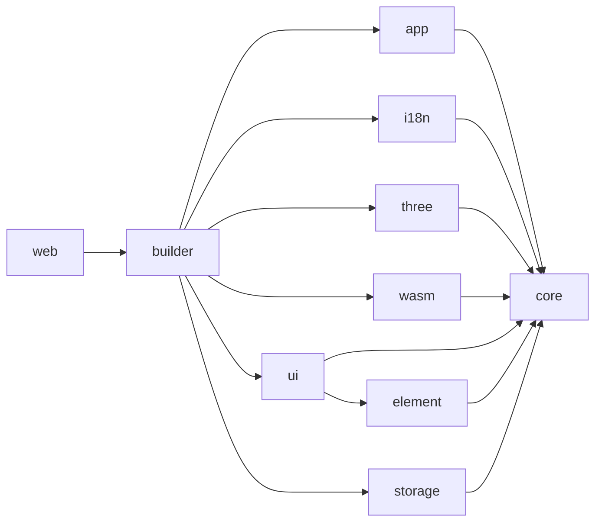
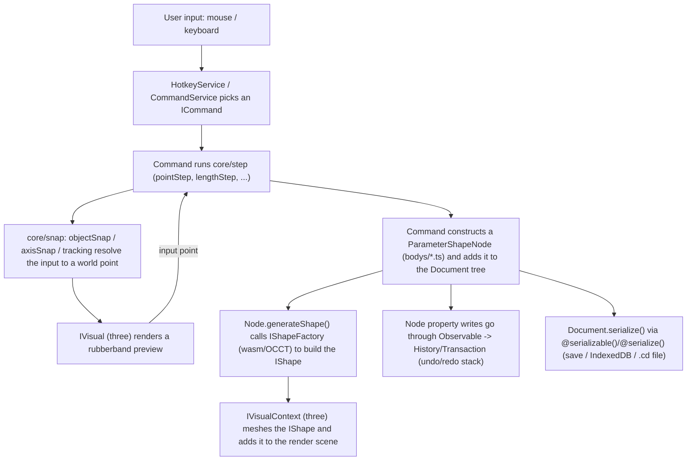

# Draftworks — Project Architecture

This document describes **how the Draftworks codebase is actually organized**: the package
graph, what each folder is responsible for, and the patterns that repeat across the
codebase. It is a map of the repo as it exists, not a proposal.

> Related doc: [`2d-clone-roadmap.md`](./2d-clone-roadmap.md) tracks an in-progress effort
> on this branch to lock the app into a 2D top-down drafting mode. This document describes
> the general architecture that effort is built on top of.

---

## 1. What it is

A browser-based parametric CAD application: an OCCT (OpenCascade) C++ geometry kernel
compiled to WebAssembly does all real geometry construction (B-Rep solids, curves,
surfaces, booleans, fillets, meshing), and Three.js renders the result. Everything above
the kernel — the document model, undo/redo, commands, snapping, UI — is TypeScript.

## 2. Package graph

- **`core` is the only package with no dependency on any other workspace package.**
  It defines interfaces (`IShape`, `IDocument`, `IVisual`, `IStorage`, `IShapeProvider`,
  `ICommand`, ...); every other package either implements one of those interfaces or
  consumes them. This is why `core/src` has no concrete geometry kernel, no DOM
  rendering, and no storage backend inside it — those are swapped in at startup.
- **`app`** owns the concrete document (`Application`, `Document`), the parametric body
  node classes, and the command implementations — but still only talks to geometry and
  rendering through the `core` interfaces (`IShapeProvider`, `IVisualFactory`), never to
  `wasm` or `three` directly.
- **`builder`** is the composition root: it's the only package that imports `wasm`,
  `three`, `storage`, `i18n`, and `ui` together and wires the concrete implementations
  into an `Application`.
- **`web`** is the thinnest layer — the actual HTML entry point — and only calls into
  `builder`.

## 3. Package-by-package

### `packages/core` — everything abstract

No DOM, no OCCT, no Three.js. Defines the contracts every other package implements and
the framework-agnostic machinery the whole app runs on.

| Folder | Purpose |
| :--- | :--- |
| `foundation/` | Cross-cutting primitives: `Observable`/`HistoryObservable` (reactive base classes), `PubSub` (event bus), `Result<T,E>` (fallible-op wrapper, see §4), `History`/`Transaction` (undo/redo), `AsyncController`, `Binding`, `ObservableCollection`, `Id`, `Logger`, `unitSetup.ts` (AutoCAD-style length formatting/parsing) |
| `model/` | The document tree: `Node` (base, doubly-linked list of siblings — see §4), `VisualNode` → `GeometryNode` → `ShapeNode` → `ParameterShapeNode`/`EditableShapeNode`, `FacebaseNode`, `FolderNode`, `GroupNode`, `MeshNode`, `Annotation`, `Component` |
| `shape/` | Geometry-side interfaces: `IShape`, `ICurve`, `ISurface`, `IShapeFactory`, `IShapeProvider`, `shapeType.ts`, `meshData.ts` — what a concrete kernel (`wasm`) must implement |
| `snap/` | The 2D/3D snapping engine: `snaps/` (`objectSnap`, `axisSnap`, `planeSnap`, `pointOnCurveSnap`, `surfaceSnap`), `handlers/` (per-input-type event handlers: point/length/angle), `tracking/` (alignment-line tracking), `snap.ts` (orchestrator) |
| `step/` | Multi-step input primitives commands compose from: `pointStep`, `lengthStep`, `angleStep`, `selectStep` |
| `command/` | Command infrastructure: `ICommand`/`CancelableCommand`, `@command()` decorator, `CommandStore` (registry), `commandKeys.ts`, `shortcutProfiles.ts` |
| `eventHandlers/` | Selection-related `IEventHandler` implementations (node/shape/general selection) |
| `serialize/` | `@serializable()` / `@serialize()` decorators and `Serializer` — reflection-based JSON (de)serialization keyed by class name (`__cla$$__`) |
| `visual/` | Rendering-side interfaces: `IVisual`, `IView`, `IVisualFactory`, `IVisualContext`, `ICameraController`, `IHighlighter`, `viewGizmo`, `meshExporter` — what a concrete renderer (`three`) must implement |
| `math/` | `XYZ`, `XY`, `Matrix4`, `Plane`, `Quaternion`, `Ray`, `BoundingBox`, `mathUtils` |
| `ui/` | Chrome-agnostic UI interfaces only: `IWindow`, `button.ts`, `dialog.ts`, `ribbon.ts`, `combobox.ts` (implemented concretely in `packages/ui`) |
| `plugin/` | Plugin manifest format and `PluginManager` contract |
| `i18n/` | `I18n` registry and translation-key types (`keys.ts`); locale data itself lives in `packages/i18n` |
| Top-level files | `application.ts` (`IApplication`), `document.ts` (`IDocument`), `service.ts` (`IService`: `register`/`start`/`stop`), `selection.ts`, `selectionFilter.ts`, `material.ts`, `modelManager.ts`, `navigation.ts`, `editor.ts`, `config.ts`, `constants.ts` |

### `packages/app` — the concrete application

Implements `core`'s interfaces into a real running app: the actual `Document`/
`Application` classes, every parametric body, and every command.

| Folder/File | Purpose |
| :--- | :--- |
| `application.ts` | `Application implements IApplication` — owns `documents`, `views`, `activeView`, `services`, `pluginManager`, drag/drop + file import wiring |
| `document.ts` | `Document implements IDocument` — one open drawing/model: selection, picker, history, visual, model manager |
| `bodys/` | One file per parametric shape, each a `ParameterShapeNode` subclass implementing `generateShape(): Result<IShape>` — `line.ts`, `arc.ts`, `circle.ts`, `ellipse.ts`, `rect.ts`, `polygon.ts`, `regularPolygon.ts`, `wire.ts`, `point.ts`, `face.ts` (2D-ish) alongside `box.ts`, `sphere.ts`, `cone.ts`, `cylinder.ts`, `pyramid.ts` (3D primitives), `extrude.ts`, `revolve.ts`, `sweep.ts`, `pipe.ts`, `boolean.ts`, `fuse.ts` (3D operations) |
| `commands/` | `ICommand`/`CancelableCommand` implementations, registered via `@command()`: `create/` (one tool per primitive/operation), `modify/` (move, rotate, mirror, trim, fillet, chamfer, array, split, shell, explode, ...), `measure/` (length, angle), `application/` (new/open/save/export document), plus `undo.ts`, `redo.ts`, `delete.ts`, `folder.ts`, `boolean.ts`, `workingPlane.ts`, `unitSetupCommand.ts` |
| `services/` | `CommandService` (executes commands, tracks `lastCommand`), `HotkeyService` (keyboard → command dispatch) — both `IService` |
| `picker.ts` | Screen-ray → document-object picking, backs interactive selection during commands |
| `selectionManager.ts` | Tracks/mutates the active `ISelection` |
| `pluginManager.ts` | `IPluginManager` implementation — loads plugins from URL/file |
| `showPropertyEventHandler.ts` | Drives the property panel from the current selection |

### `packages/builder` — composition root

`AppBuilder` (fluent chain: `.useIndexedDB().useWasmOcc().useThree().useUI().build()`)
is the only place that imports the concrete `wasm`/`three`/`storage`/`ui` packages and
assembles a real `Application`. `ribbon.ts` defines the default ribbon-tab layout;
`defaultDataExchange.ts` wires import/export.

### `packages/wasm` — the geometry kernel binding

Implements `core`'s `shape/` interfaces on top of OCCT compiled to WebAssembly.
`factory.cpp`-backed `factory.ts` → `OccShapeProvider`/`IShapeFactory`, plus
`shape.ts`, `curve.ts`, `surface.ts`, `geometry.ts`, `converter.ts` (STEP/IGES/BREP/STL
import-export), `stlWriter.ts`. `initWasm()` boots the WASM module. The C++ source
compiled into this package lives outside `packages/` in `cpp/src/` (`factory.cpp`,
`shape.cpp`, `converter.cpp`, `mesher.cpp`, `geometry.cpp`); build output lands in
`packages/wasm/lib/chili-wasm.{wasm,js,d.ts}`.

### `packages/three` — the renderer

Implements `core`'s `visual/` interfaces with Three.js: `threeVisual.ts`
(`IVisual`), `threeView.ts` (`IView`, canvas + render loop), `threeVisualContext.ts`,
`threeVisualFactory.ts`, `cameraController.ts` (`ICameraController` — perspective/
orthographic, pan/zoom/orbit), `threeHighlighter.ts`, `threeGeometryFactory.ts` /
`threeGeometry.ts` (kernel `IShape` → Three.js `BufferGeometry`), `viewGizmo.ts`,
`meshExporter.ts`, `outlinePass.js` (selection outline post-process).

### `packages/ui` — app chrome

Concrete Web Components (built on `packages/element`) implementing `core`'s `ui/`
interfaces: `mainWindow.ts` (`IWindow`, top-level shell), `ribbon/` (ribbon bar,
buttons, split/pulldown/toggle variants, command context panel), `project/tree/`
(project tree view), `property/` (property panel, incl. `material/` editor),
`viewport/` (viewport container + `flyout/` in-canvas input/tip widgets),
`statusbar/` (grid/ortho/osnap toggles, `snapConfig.ts`), `toast/`, `home/` (landing
page, language/theme/navigation selectors), `dialog.ts`, `floatPanel.ts`, `editor.ts`,
`cursor/`.

### `packages/element` — reactive DOM primitives

Framework-free custom elements the rest of `ui` builds on: `elements.ts` (base
reactive-element helpers), `radioGroup.ts`, `expander/`, `converters/` (value↔attribute
converters: string/number/color/url/xyz), `collection.ts`, `htmlProps.ts`.

### `packages/i18n`, `packages/storage`, `packages/web`

- **`i18n`** — locale data only (`en.ts`, `zh-cn.ts`, `pt-br.ts`, `ru.ts`), registered
  into `core`'s `I18n` by `AppBuilder`.
- **`storage`** — `IndexedDBStorage implements IStorage` (document/plugin persistence).
- **`web`** — the actual HTML entry point: `index.ts` bootstraps `AppBuilder`,
  `loading.ts` is the loading screen, `startupParams.ts` parses `?plugin=`/`?url=`/
  `?model=` query params.

### `plugins/`

Example third-party plugins (outside `packages/`), loaded at runtime via
`pluginManager.loadFromUrl`/`loadFromFile` — not part of the compiled app.

---

## 4. Patterns that repeat across the codebase

- **Interface in `core`, implementation elsewhere.** `IShapeProvider` → `wasm`,
  `IVisualFactory` → `three`, `IStorage` → `storage`, `IWindow` → `ui`. `AppBuilder`
  is the only place these are tied together, so `core`/`app` never import a concrete
  backend directly.
- **`Result<T, E>` for fallible operations** (`core/src/foundation/result.ts`).
  Anything that calls into the OCCT/WASM kernel can fail on degenerate geometry, and
  that's treated as an expected, checkable outcome — `Result.ok(value)` /
  `Result.err(error)` — never an exception. `ShapeNode.generateShape()` is typed
  `Result<IShape>` everywhere.
- **Reactive properties via `Observable`.** Classes store state with
  `getPrivateValue(key)`/`setPrivateValue(key, value)`; the `set` accessor calls
  `setProperty(...)`, which emits `emitPropertyChanged`. `Node extends
  HistoryObservable` so every property write on any document-tree node is
  automatically undo/redo-eligible without each subclass wiring that up.
- **The document tree is a doubly-linked list, not an array.** `Node` has
  `parent`/`previousSibling`/`nextSibling` fields rather than being stored in a
  parent's children array — reordering (drag in the tree, undoing a delete) is an
  O(1) pointer relink. `INodeLinkedList` (folders/groups) is a separate interface
  from `INode` (leaves), sharing identity but not children-management.
- **Body node hierarchy**: `Node` → `VisualNode` → `GeometryNode` → `ShapeNode` →
  `ParameterShapeNode` (most `bodys/*.ts`) / `EditableShapeNode`. A
  `ParameterShapeNode` subclass declares `@serialize() @property()` parameters and
  implements `generateShape(): Result<IShape>`; calling `setPropertyEmitShapeChanged()`
  in a property setter marks the shape dirty so it's regenerated (via the injected
  `IShapeFactory`) and re-rendered.
- **Serialization** — `@serializable()` on a class, `@serialize()` on fields/accessors;
  `Serializer` (de)serializes to/from `{ __cla$$__: "ClassName", ...props }` using a
  reflection map keyed by class name, so persisted documents and command undo
  snapshots don't need hand-written (de)serializers per class.
- **Commands** — `ICommand.execute(application): Promise<void>`; `CancelableCommand`
  adds `cancel()`, an `AsyncController`, and a dispose stack for cleanup. Registered
  with `@command(metadata)` into `CommandStore`; `CommandService` looks commands up by
  key and runs them; `HotkeyService` maps keystrokes to command keys.
- **Undo/redo** — `Transaction` snapshots state, `History` keeps the undo/redo stacks;
  commands open a transaction implicitly through the `Observable`/`Node` property-write
  path described above, not by hand-rolling snapshots per command.
- **Global singleton access** — `getCurrentApplication()` (from `core`, set once by
  `Application`'s constructor) is used where threading an `IApplication` through every
  call would be impractical (e.g. deep in body-node property setters), instead of a DI
  container.
- **Plugins** — loaded from a URL, a `.chiliplugin` file, or `?plugin=`; manifest format
  in `core/src/plugin/manifest.ts`, runtime in `core/src/plugin/manager.ts` +
  `app/src/pluginManager.ts`.

## 5. Runtime data flow (interactive drawing command)

## 6. Build & test

See [`CLAUDE.md`](../CLAUDE.md) for exact commands (`npm run dev`, `npm run build`,
`npm run test`, `npm run build:wasm`, etc.) and coding conventions.
